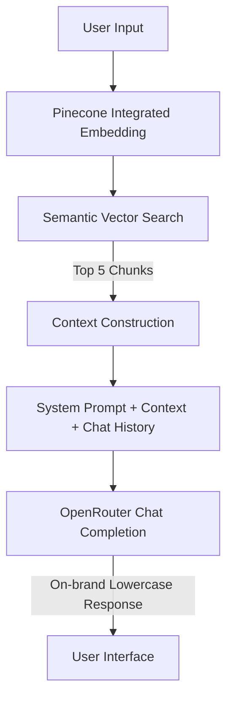

# ✦ about-face cosmetics RAG Chatbot ✦

An immersive, high-performance Retrieval-Augmented Generation (RAG) chatbot (codenamed **"the muse"**) designed for **about-face cosmetics**—the bold, clean, vegan, and cruelty-free makeup brand founded by **Halsey**. 

"the muse" is a bespoke digital companion that helps users break beauty boundaries, explore the product line, discover shade matches, review shipping/return policies, and receive professional application tips—all packaged inside a sleek, on-brand interface matching about-face's distinct visual identity.

---

## 🎨 Visual Identity & Aesthetic

The chatbot interface is styled according to the about-face brand guidelines:
*   **Color Palette**: High-contrast dark theme powered by deep charcoal/blacks, clean whites, and the signature brand accent: **Neon Green (`#00FF01`)**.
*   **Typography**: Clean sans-serif headings (**Gothic A1**) paired with developer-chic accents (**Space Mono**) for a raw, artist-driven feel.
*   **Micro-interactions**: Seamless slide-in animations, an attention-grabber indicator, interactive quick-suggestion chips, and dynamic scroll control.
*   **Tone**: Confident, inclusive, lowercase, and artistic—acting as a knowledgeable friend rather than a corporate assistant.

---

## 🛠️ Technology Stack

### Backend & RAG Pipeline
*   **Runtime**: Node.js (ES Modules, `"type": "module"`)
*   **API Framework**: Express
*   **Retrieval**: Pinecone semantic vector search with local fallback
*   **LLM Provider**: OpenRouter
    *   **Chat Generation**: `openrouter/free` by default with an OpenRouter key
    *   **Embeddings**: Pinecone integrated inference with `multilingual-e5-large`

### Frontend
*   **Core**: Vanilla HTML5 / JavaScript (ES6)
*   **Styles**: Raw CSS3 using dynamic variables and modern flexbox/grid layouts

### Deployment
*   **Hosting**: Pre-configured for serverless execution on **Vercel** (`vercel.json`)

---

## 🧠 System Architecture

The chatbot utilizes a standard RAG pipeline to ensure that all generated answers are strictly grounded in official brand data.



1.  **Ingestion & Seeding (`seed-knowledge.js`)**:
    Reads [about-face-knowledge-base.md](./about-face-knowledge-base.md), splits it into cohesive chunks, and sends the text records to Pinecone. Pinecone embeds and stores them using `multilingual-e5-large`.
2.  **Retrieval (`rag-engine.js`)**:
    Sends each question to the integrated Pinecone index and selects the five most semantically relevant chunks. `knowledge-search.js` provides a local fallback if Pinecone is unavailable.
3.  **Generation**:
    Injects context and recent conversation history (last 6 turns) into the custom system prompt configured with the brand's lowercase, welcoming persona.

---

## 📂 Project Structure

```
about-face-chatbot/
├── .env.example                # Template for environment credentials
├── .gitignore                  # Git exclusions (node_modules, .env, logs)
├── about-face-knowledge-base.md # Core source document for RAG data
├── api/
│   └── index.js                # Serverless function entrypoint for Vercel
├── dl.mjs                      # Image downloader configuration
├── download_images.js          # Helper script for fetching demo media assets
├── download_images.ps1         # PowerShell variant of the image downloader
├── package.json                # Project dependencies and run scripts
├── knowledge-search.js         # Shared chunking and local search fallback
├── rag-engine.js               # Retrieval selection and chat generation
├── seed-knowledge.js           # Knowledge base parsing, chunking, and database seeding script
├── server.js                   # Express application serving frontend & API endpoint
├── vercel.json                 # Vercel rewrite configuration
└── public/                     # Static frontend assets
    ├── index.html              # Main application markup & chat UI shell
    ├── styles.css              # Custom brand-aligned stylesheets
    ├── app.js                  # Frontend controller (state, UI interactions, API)
    └── images/                 # Image assets (hero visual & textures)
```

---

## 🚀 Getting Started

### 1. Prerequisites
Ensure you have [Node.js](https://nodejs.org/) installed (v18+ recommended). You will also need **OpenRouter** and **Pinecone** API keys. No OpenAI key is required.

### 2. Installation
Clone the repository and install dependencies:
```bash
git clone https://github.com/Protagonist01/aboutface-chatbot-demo.git
cd aboutface-chatbot-demo
npm install
```

### 3. Environment Setup
Copy the template `.env.example` file and populate it with your API keys:
```bash
cp .env.example .env
```
Open `.env` and fill in the values:
```env
OPENROUTER_API_KEY=your-openrouter-api-key
CHAT_MODEL=openrouter/free
PINECONE_API_KEY=your-pinecone-api-key
PINECONE_INDEX_NAME=about-face-kb
PINECONE_EMBEDDING_MODEL=multilingual-e5-large
MAX_MESSAGE_LENGTH=800
IP_RATE_LIMIT_MAX_REQUESTS=8
DAILY_GLOBAL_REQUEST_LIMIT=250
PORT=3000
```

`openrouter/free` automatically selects an available free chat model. Pinecone
integrated inference embeds both the knowledge chunks and incoming questions,
so vector search does not consume OpenAI credits. If Pinecone is temporarily
unavailable, the app falls back to local ranked search.

The public demo includes basic abuse controls:
*   `MAX_MESSAGE_LENGTH`: rejects long prompts before any model call.
*   `IP_RATE_LIMIT_MAX_REQUESTS` + `IP_RATE_LIMIT_WINDOW_MS`: caps bursts per IP.
*   `DAILY_GLOBAL_REQUEST_LIMIT`: caps total daily chat requests per running server instance.
*   `MAX_OUTPUT_TOKENS`: caps response size.

For production-grade daily limits on Vercel/serverless, use a shared store such
as Upstash Redis or Vercel KV. In-memory counters reset when a serverless
instance restarts or when traffic is split across multiple instances.

### 4. Vector Index Seeding
Create the integrated Pinecone index and populate it with the knowledge base:
```bash
npm run seed
```

### 5. Running the Application
Launch the dev server with hot-reload enabled:
```bash
npm run dev
```
Open your browser and navigate to: **`http://localhost:3000`**

---

## 🔌 API Documentation

### POST `/api/chat`
Endpoint to process chat messages using the RAG pipeline.

*   **Request Body**:
    ```json
    {
      "message": "how much is the matte fluid eye paint?",
      "history": [
        { "role": "user", "content": "hello" },
        { "role": "assistant", "content": "hey ✦ welcome to about-face." }
      ]
    }
    ```
*   **Success Response** (200 OK):
    ```json
    {
      "reply": "our matte fluid eye paint is $18. it's a powerful, one-swipe liquid eye color with bold, buildable pigment that dries down to a no-budge matte finish. 💚"
    }
    ```

### GET `/api/health`
Simple check for service status and uptime.
*   **Success Response** (200 OK):
    ```json
    {
      "status": "ok",
      "timestamp": "2026-06-23T14:30:00.000Z"
    }
    ```

---

## 🛫 Deployment

The project is optimized for deployment on [Vercel](https://vercel.com/):

1.  Connect your repository to Vercel.
2.  Configure `OPENROUTER_API_KEY`, `CHAT_MODEL=openrouter/free`, `PINECONE_API_KEY`, `PINECONE_INDEX_NAME=about-face-kb`, and `PINECONE_EMBEDDING_MODEL=multilingual-e5-large` in the Vercel Dashboard.
3.  Deploy! Vercel will build the frontend assets and host the Express routes serverlessly via the `/api/index.js` bridge.

---

## 💚 License
This project is licensed under the [ISC License](package.json).
